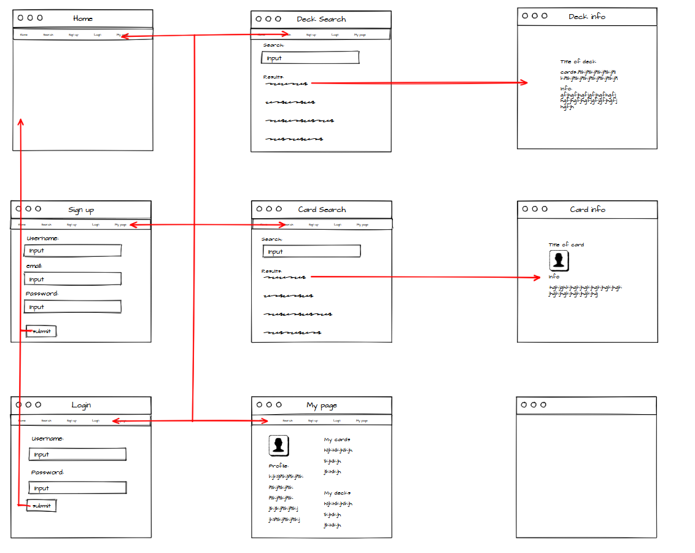

# Project2

# Description
This page is used to manage your magic decks and find new decks and cards

# MVP
Home page, 
Decks search page,
Cards search page,
Personal page,
Deck info page,
Card info page,
Call to Magic's API for the cards info
User and Deck Model
CRUD + authentication and authorization
Resposive page

# Backlog
Cards market,
Events (tournaments...),
Basic version of the game

# Wireframes

https://wireframepro.mockflow.com/view/Ma9f049c5e2ef4f1452e77725e0e4fb091602166447826

# APIs
https://api.magicthegathering.io

# Structure
project2/
        |------ .gitignore
        ├── .env
        ├── app.js
        ├── readme.md
        ├── bin
        │   ├── seeds.js
        │   └── www
        ├── middlewares
        │   └── auth-mid.js
        ├── models
        │   ├── deck.js
        │   └── user.js
        ├── public
        │   ├── images
        │   ├── scripts
        │   └── stylesheets
        ├── routes
        │   ├── index.js
        │   ├── deck.js
        │   ├── auth.js
        │   └── private
        │       ├── myPage.js
        │       └── ???????.js
        │
        └── views
            ├── error.hbs
            ├── index.hbs
            ├── layout.hbs
            ├── deckSearch.hbs
            │       └── deckInfo.hbs
            ├── cardSearch.hbs
            │       └── cardInfo.hbs
            ├── auth
            │   ├── login.hbs
            │   └── signup.hbs
            └── private
                ├── myPage.hbs
                └── ??????.hbs

**root/**

- awget.html
- index.html
- signup.html
- **css/**
  - form.css
  - styles.css
  - **fonts/**
    - font.ttf
- **img/**
  - cover.png
- **scripts/**
  - apiCall.js
  - awget.js
  - awget-disk.js
  - database.js
  - login.js
  - signup.js
  - users.js
  - validator.js
- **assets/**
  - img/
  - fonts/

**root/**

- awget.html
- index.html
- signup.html
- **css/**
  - form.css
  - styles.css
  - **fonts/**
    - font.ttf
- **img/**
  - cover.png
- **scripts/**
  - apiCall.js
  - awget.js
  - awget-disk.js
  - database.js
  - login.js
  - signup.js
  - users.js
  - validator.js
- **assets/**
  - img/
  - fonts/

# Routes

MethodRouteDescriptionRequest - BodyGET/Main page route. Renders home index view.GET/loginRenders login form view.POST/loginSends Login form data to the server.{ username, password }GET/signupRenders signup form view.POST/signupSends SignUp info to the server and creates user in the DB.{ name, email, password }GET/randomRenders to the random card pageGET/userPriv route. Renders user view and list projects and cardsGET/project/create/Priv route. Renders create projects form.POST/project/create/:_idPriv route. Sends new projects info to server, updates DB.{ projectname, description}GET/project/edit/Priv route. Renders edit projects form.PUT/project/edit/:_idPriv route. Sends edit projects info to server, updates DB.{ projectname, description }POST/card/create/Priv route. Sends new cards info to server, updates DB.{ description }GET/card/create/Priv route. Renders create cards form.DELETE/projectsPriv route. Deletes user project from DB.DELETE/cardsPriv route. Deletes user card from DB.GET/logoutPriv route. Destroy current session. Renders home index view.

# Models
User model
  {
    username: String,
    email: String,
    password: String,
    imgPath: { type: String, default: 'project/public/images/wireframe.png' },
    decksId: [{ type: Schema.Types.ObjectId, ref: 'Deck' }]
  }
Deck model
  {
    title: { type: String, required: true, unique: true },
    description: String,
    cards: {type:[String], required: true},
    userId: { type: Schema.Types.ObjectId, ref: 'User' }
  }

# Links
GitHub
https://github.com/xcaparros89/Project2

Heroku
...

Trello
https://trello.com/invite/b/QA7dhTFu/48c335959060ca3fd50a64b7a025937d/m2-proyecto
